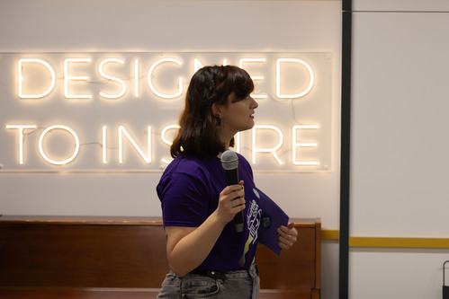
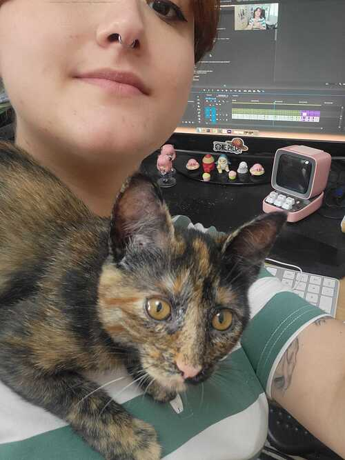
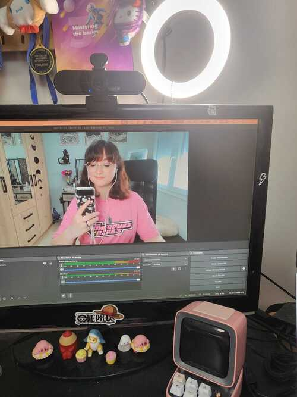
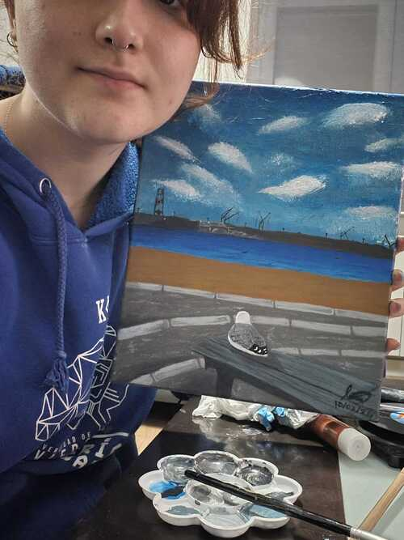

Hi, I’m Ana! 👋

I’m a creative Computer Science Engineer turned into a DevRel enthusiast, blending my love for technology and people into a career I’m truly passionate about. Based in the beautiful city of Gijón, Asturias (a place I adore!), my journey began while completing my studies at [The School of Computer Engineering](https://ingenieriainformatica.uniovi.es/) at the University of Oviedo.

Throughout my student years, I gained invaluable experience as a student representative, sharpening my teamwork, communication, and problem-solving skills. These experiences shaped me into a developer who thrives on collaboration, innovation, and engaging with others—qualities that are often rare in our field.

What sets me apart is my unique balance between technical expertise and public speaking. I genuinely enjoy diving deep into code as much as I love sharing insights, connecting with the community, and telling stories. That’s why I created this page—it’s not just a portfolio but also a space to share my thoughts, experiences, and tips in the blog section.

Welcome to my corner of the web! 🌟

<h3>Student Representation</h3>

My professional journey wouldn’t be complete without highlighting my time in Student Representation. Those years were transformative, pushing me to achieve things I never imagined—organizing events, traveling, launching new initiatives, managing diverse teams, and even mentoring incoming students.

 I had the honor of being elected president of several university organizations and serving on the board of directors of[RITSI](https://ritsi.org/) during my final year—a national student representation organization. Though my formal role has ended, I still enjoy contributing by giving talks and supporting projects whenever I can.

These experiences not only shaped my skills and perspective but also brought me lifelong friendships—and one very special relationship! I now share my life with an amazing partner and our adorable cat, Tortitas (Spanish for Pancakes 😉).

<h3>Projects</h3>

I’ve had the opportunity to work on a diverse range of projects using various programming languages and technologies. At work, my go-to language is Java, but my portfolio spans much more:

* **Final Degree Project**: I built a [full-stack web application](https://github.com/AnaGciaSchz/Heritage) using JavaScript, handling both the frontend and backend development. I also designed the site and drew the logo.
* **Academic Projects**: During my studies, I worked extensively with Python and C#, honing my problem-solving and programming skills.
* **Server and DevOps Experience**: While collaborating with [RITSI](https://ritsi.org/), I managed servers and worked with technologies like PHP, WordPress, and Docker.
* **Collaborative Projects**: I also contributed to two team projects using [SOLID](https://solid.mit.edu/), exploring the future of decentralized data ownership.

<h4>Recent Highlights</h4>

One of my most exciting recent projects involved Docker. My goal was to encapsulate the [Empathy Platform](https://docs.empathy.co/) earch product into a Docker container, creating a streamlined setup that allowed users to get a working version up and running within minutes.

This project wasn’t just about technical implementation—I also focused on making the solution user-friendly by enabling easy customization and providing comprehensive resources like documentation and tutorials. The result? The [Empathy Self-Managed Components](https://docs.empathy.co/understand-empathy-platform/about-empathy-platform/self-managed-components-overview.html). You can check out the code [here](https://github.com/empathyco/empathy-self-managed-components)

<h3>Software Engineering and DevRel</h3>

My career began as a Backend Engineer, starting with an internship and quickly growing by diving deep into the product. I progressed from creating demos to joining the search team, eventually setting up new clients independently. Throughout this time, my passion for public speaking and documentation was evident, and when I delivered my first international talk, I realized I had found my calling.

I continued to refine my skills, focusing on privacy research and collaborating with my teammates to shape [Visible Privacy](https://visibleprivacy.com/). This experience broadened my perspective and further fueled my drive to connect technology with people.

All of this work led to a pivotal moment: becoming the company’s first DevRel. In this role, I’ve embraced a variety of responsibilities, from generating content and developing marketing strategies to leading projects and editing videos. Each challenge has been an opportunity to grow—and I’m excited to see what’s next on this incredible journey!

<h3>Hobbies</h3>

I’m currently taking theatre classes, and I’ve had the opportunity to work on three productions so far. Recently, I even landed a role in a professional theatre representation as an actress—an experience that has been both challenging and rewarding.

In my free time, I enjoy painting, a hobby I’ve recently picked up again, and coding personal projects just for fun. I’ve also started going to the gym regularly, and one of my proudest recent achievements is overcoming my fear of riding a bike!

When I’m not busy with these activities, you can usually find me taking long walks, exploring cozy cafés, or catching up with friends. I also used to play role-playing games and still have a fondness for those creative adventures.

<h3>What is 'anuskuskus'?</h3>

It’s my nickname! One of my favorite teachers gave it to me back in school, and it stuck. Over time, I started using it for my social media accounts, and now some people even call me that in real life. My boyfriend thought it was unique enough to buy this domain for me—so why not embrace it?

Fun fact: Sometimes, websites flag it as containing bad words (I promise it’s harmless!), so I have to settle for using 'kuskus' instead. Life of a quirky nickname, I guess! :')

<h3>How to contact me</h3>

If you’d like to reach out, [LinkedIn](https://www.linkedin.com/in/anagciaschz/) is a great place to connect! Whether you’re curious about a project, have a question, or just want to chat, I’d be happy to hear from you.

Feel free to reach out in Spanish or English. Or even Asturian if you’d like to give it a try!