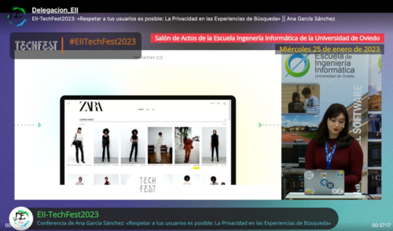

I like participating in events, videos and giving talks; sometimes, those talks are recorded and uploaded on the internet, so I will put the links here so you can enjoy them. 

<h3>Relevance is not a Thing but a Perception</h3>

My first talk in a Tech event! I participated in Berlin Buzzwords 2022 edition and it was a pleasure.

<h4>Description</h4>

When talking about relevance regarding search, it often sounds like it is a thing, something that can be touched and seen. Nevertheless, that is not the case. What do I mean by that? In this talk, I will provide some examples of how relevance is often merely seen as a score when it can be, in fact, an engaging relationship where the user and the search UI connect in aesthetic and enjoyable ways. I will present numerous examples of innovative search experiences that challenge prevailing schemas and structures and lead instead to elements of motion and correlated visual action that allows us to perceive the beauty of relevancy on a different level. Because relevance is a matter of perception.

<h4>Recording</h4>



<h3>A different way of thinking: non-technical introduction to DSLs</h3>

My talk at ShuttleCon First Edition

<h4>Description</h4>

On this talk I explain how to solve a problem using a DSL. I also introduce the public about what a DSL is.

<h4>Recording</h4>

You can see my talk at 1:08:36

