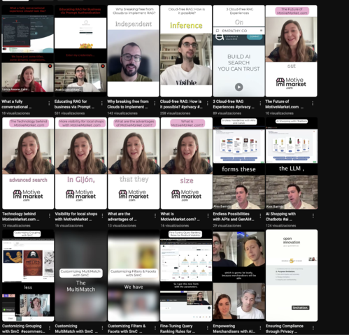

As I mentioned in the [About me](https://www.anuskuskus.me/about-me/) section, I love editing videos. What started as a fun hobby has now evolved into a valuable skill, and some of my work is even shared on my company’s social media channels. It's amazing how a hobby can turn into something useful! Here are a few of my creations:

<h3>Linkedin Lives</h3>

At Empathy, we regularly host LinkedIn Lives, and I wanted to improve the quality of the re-uploaded videos. So, I started editing them! You can find the edited versions on [Empathy.co's Youtube channel](https://www.youtube.com/@Empathyco_/videos). My very first edited video is this one—because, honestly, starting with ABBA is always a great choice:



I also generate shorts of the most interesting parts and upload them on [The Youtube channel](https://www.youtube.com/@Empathyco_/shorts).

<h3>Youtube Videos</h3>

I’ve appeared in a few YouTube videos, and what’s even more interesting is that I edited them myself! As a perfectionist, it’s something I’m still getting used to, but I’m definitely moving in the right direction!

My first ever professional edited video where I appear (I needed some help with it) is this one:



I created the script and had to get used to speaking directly to the camera—something that took a bit of adjustment. Honestly, I still prefer live talks over pre-recorded ones!

<h4>SMC</h4>

I showed some videos I did about SMC in the [My Talks](https://www.anuskuskus.me/my-talks/) section, but I did some tutorials and exclusive videos too!

* [Empathy Platform Self-managed Components are Live!](https://www.youtube.com/watch?v=_DUVB8KQ-LY)
* [Download, deploy, and enjoy SmC Tutorial](https://www.youtube.com/watch?v=gYEC50SqI0A)
* [How to Customize SmC Catalogs Tutorial](https://www.youtube.com/watch?v=DdBJk6zXhOk)
* [How to Customize SmC Search Experience Tutorial](https://www.youtube.com/watch?v=CLeaLzolEJc)

The most fun part? Editing and uploading the bloopers to my YouTube channel! You can check them out here:



<h3>Instagram Videos</h3>

I recently started working in other social media accounts of the company, and of course, I edited some videos. [Here](https://www.instagram.com/motivemarket.com_/) you can find some of them. The shop interview series, the live draw for bikes, the interviews in the streets of Gijón... 

and I also worked on the editing of a awareness video for the account, designing the transitions and giving my [own voice](https://www.instagram.com/reel/DCwklHIsIwm/).