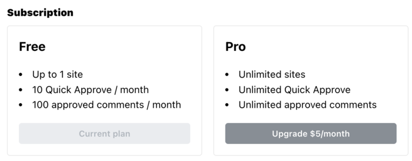
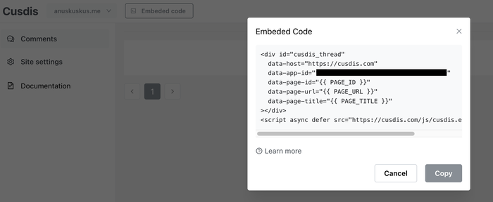
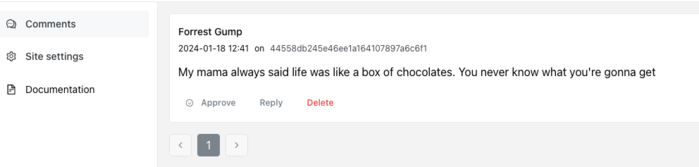
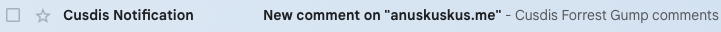

<h3>What is Cusdis?</h3>

That was my first question when deciding on a technology for my comment section on posts.

As they say on their website, [cusdis.com](https://cusdis.com/):

> **Cusdis** is an open-source, lightweight, privacy-first **alternative to Disqus**. It's super easy to use and integrate with your existing website. We don't track you and your users."

And what is [Disqus](https://disqus.com/about-us/)? It's a commonly used commenting system on various websites and online communities, allowing users to comment on anything and participate in blog discussions.

Of course, as a proud developer at [Open Innovation in Privacy](https://oi.empathy.co/#open-privacy), when I discovered that there was a commenting technology similar to one of the most popular ones but with a commitment to user privacy, I had to choose it.

<h3>How to host it?</h3>

At first,  I assumed I needed to host the technology by myself, but that wasn't the case.

Cusdis offers a free plan to host one site and manually moderate up to one hundred comments per month, with an additional ten comments that can be moderated automatically. You can also pay $5/month for unlimited sites and moderation features.



<h3>How to set it up?</h3>

When registering on Cusdis, you can generate a board for your site and get all the necessary information.

The platform gives you the embedded code you need to set it up:



If you are using the [same template as me](https://github.com/CaiJimmy/hugo-theme-stack) on your website, you can take the id from that embedded code (the `data-app-id` value) and put it in the configuration (on `config/_default(params.toml`):
```toml
## Comments
[comments]
enabled = true
provider = "cusdis"

[comments.cusdis]
host = "https://cusdis.com"
id = "pasteTheIdHere"
```

<h3>How does it work?</h3>

The comments can be anonymous, as users can opt for a random username each time they engage. To maintain a positive and safe environment, comments aren't published immediately.

As the page owner, you can moderate them through the dashboard:



And don't worry about knowing when a user comments on your page. Cusdis will alert you via e-mail ;)



<h3>Conclusion</h3>

If you are looking for a commenting system, give it a try to this privacy-first alternative. It's not just user-friendly; it's a reliable and privacy-conscious choice!

-----

> Image taken from [cusdis.com](https://cusdis.com/)
