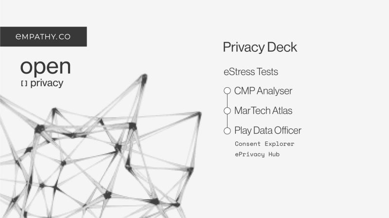

The mission of a Data Protection Officer (DPO) revolves around ensuring that the organisation processes the personal data of its staff, customers, providers or any other individuals in compliance with the applicable data protection rules.

This responsibility requires a deep understanding of the organisation’s operations, so communication with the different teams is critical but also challenging.

**DPOs often find themselves uninvolved in product updates and are told late about them**. It leads to quick adjustments to Privacy notices, incorrect Cookie banners, inaccurate Consent Paths and more.

That harms the DPO and those who use the products. DPOs must know about the products, technical setup and developments, but they must also work with legal, marketing, engineering teams and data scientists.

Big problems require big solutions, so we are working on **our Privacy Deck**: tools that help DPOs quickly know the reality of their products and whole teams working across departments to raise responsibility and transparency to transfer the results to customers confidently.

Here’s a summary of how these tools can transform your daily life as a Data Protection Officer:

* **CMP Analyser**: When you land on a webpage, you see a banner that asks you for consent. That banner must be accurate, and accepting or declining must make a difference. With this tool, you can test that accuracy and respect to the user. If you are in charge of the site’s data protection, you can use it to rectify any errors.
* **MarTech Atlas**: Using CMP Analyzer, we could show the names of the cookies and expect you to understand them without context, but we don’t do things like that. With this tool, we have a database of the cookies, their vendor and their purpose. A DPO can automatically know which data the organisation uses in reality and how it uses it.
* **Play Data Officer**: Data doesn’t have to be boring. That’s why we also created this dashboard with two main sections to see and interact with the information:
  * **Consent Explorer**: A view that categorises cookies by the stages at which they appear, followed by some metrics about accuracy, consistency,... It also offers the option to edit the information if needed.
  * **ePrivacy Hub**: A view with a summary of the metrics from the last analysis of cookies. It lets you compare the current results with the last one.
* **eStress Tests**: With all the information above, we generate a comprehensive examination that includes checking for trackers, calls to third-party services and other potential privacy risks. Besides, it provides valuable feedback highlighting areas where a DPO can improve user data protection.

-----

> Original post on LinkedIn [here](https://www.linkedin.com/feed/update/urn:li:activity:7122875319081926656?utm_source=share&utm_medium=member_desktop)

> Image by Empathy.co branding
