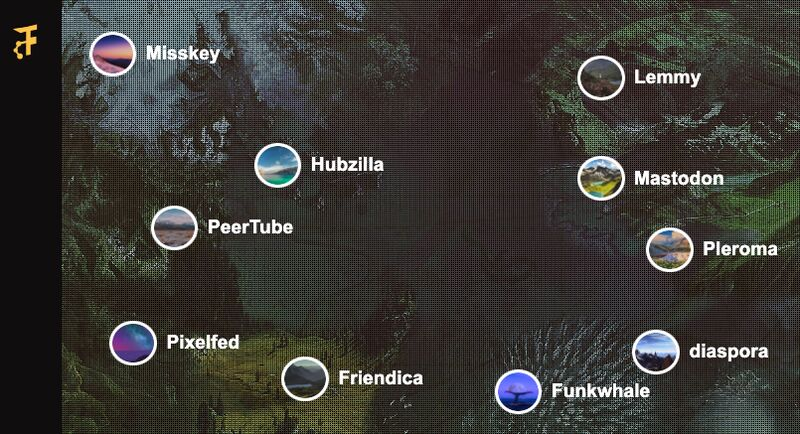

Life becomes more interesting when you have friends like [Christian Peláez](https://www.linkedin.com/in/christianpefer/), who casually starts a conversation inviting you to participate in a decentralized project for fun.

Why? Because, as many people, when he entered his Instagram account some days ago, he was prompted with the message that you can prevent Meta from using your data for ads... if you pay.

I'm not going to share my opinion, at least for now, but it is similar to the one Christian had when he deleted the app and decided to learn more about the Fediverse and try it with friends ([Sonia García](https://www.linkedin.com/in/sonia-garc%C3%ADa-lavandera-30634b206/) and [Daniel Fernández](https://www.linkedin.com/in/daniferna/) too!).

What is the Fediverse? What does decentralization mean? To explain it, it is easier if you know Mastodon, one of the social media alternatives people found when Elon Musk bought Twitter, and the world seemed to end.

Mastodon is a decentralized alternative for microblogging (like Twitter). It is decentralized the same way as e-mail is. Anyone can sign up on any server, talk to other users (in the same server or another), and even have their own server deployed at home. The data is not centralized in servers from just one company; anyone can control their data.

Federation is a form of decentralization. And the Fediverse is a set of federated social networks (Federated + Universe). But they also have another thing in common: they use the same open protocol to communicate with the servers and clients.

What does it mean? They can be connected. And they can interact between them.

The Fediverse is massive. Their technology is better than the centralized ones because their code is free (as in freedom), so anybody can see it and add features. That's why Mastodon lets you have custom emojis, thumbnail crop control, and the much-loved animated avatars Twitter had years ago.

So feel free to try new social media and take control over your data, or create a new project to add to the Fediverse. I'll leave here some alternatives you can check ;)
* Decentralized communication (Like Discord or Slack): [Matrix](https://matrix.org/)
* Federated image-sharing platform (Like Instagram): [Pixelfed](https://pixelfed.org/)
* Alternative to big tech video platforms (Like YouTube): [PeerTube](https://joinpeertube.org/en)
* [Mastodon](https://joinmastodon.org/) (of course)
* Social platform to enjoy and share music: [Funkwhale](https://www.funkwhale.audio/)
* More in [FediverseParty](https://fediverse.party/)

-----

> Original post on LinkedIn [here](https://www.linkedin.com/posts/anagciaschz_fediverse-decentralization-socialmedia-activity-7132344425447370753-Sp5g?utm_source=share&utm_medium=member_desktop)
