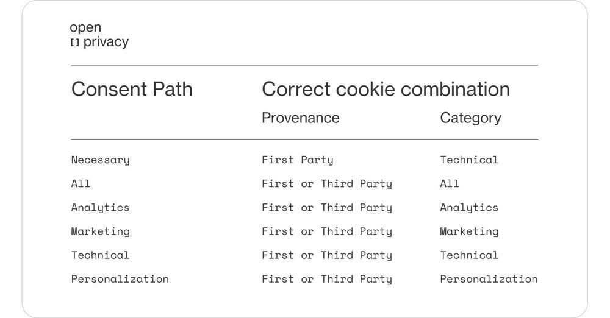

Websites will use different cookies to let us access their contents depending on our CMP (or cookie banner) choices. In other words, we will follow a different path to explore the page based on our consent choice. We will follow a different Consent Path.

Categorizing cookies can be challenging since there is no standard classification. However, the most common categorization is the one that separates them based on their origin:

- **First-party cookies**: Cookies generated by the website you are visiting.
- **Third-party cookies**: Cookies generated by another vendor, like an advertiser or an analytic system.

But if we want to know if a cookie respects user consent, we can’t just use this categorization, as not all cookies from third-party vendors, for example, have the same purpose and respect the same user consent.

So, at Empathy.co, we decided to create the following categories that we use in tools like [CMP Analyzer](https://www.linkedin.com/feed/update/urn:li:activity:7095702424358678528?utm_source=share&utm_medium=member_desktop) or [MarTech Atlas](https://www.linkedin.com/feed/update/urn:li:activity:7098231672646569984/?utm_source=share&utm_medium=member_desktop):

* **Technical cookies**: Cookies that are strictly necessary for a website to work.
* **Analytics cookies**: Cookies that collect information and statistics on the usage of a website and how effective marketing campaigns are.
* **Marketing cookies**: Cookies that create user profiles or track users across several websites. They aim to make ads more relevant to users.
* **Personalization cookies**: Cookies that store user choices and personalize a website according to them.

Depending on the Consent Path we are, we should only be served the correct cookies:

* **We accept all cookies**: The website will use all categories of cookies from first-party or any third-party.
* **We reject all cookies**: The website will use the necessary cookies. Those are just technical cookies coming from the first-party vendor.
* **We accept just some cookies**: Depending on our choices, we will get just the accepted cookies and the necessary cookies explained before. For example, let’s give consent to the website to use personalization cookies. In that case, we will follow the Personalization Consent Path and be served the necessary first-party cookies and personalization first or third-party cookies.
* **We have not accepted or rejected anything**: This is a particular part of the experience. If the user has not consented, just the necessary cookies explained in the ‘reject all cookies’ section should be used.

To understand the cookies that a webpage should serve and ensure that our choices are respected, we need to consider the different paths of consent and types of cookies. The attached table summarizes this knowledge. Information is power, they say.

-----

> Original post on LinkedIn [here](https://www.linkedin.com/feed/update/urn:li:activity:7100766916549484544?utm_source=share&utm_medium=member_desktop)

> Image by Empathy.co branding
