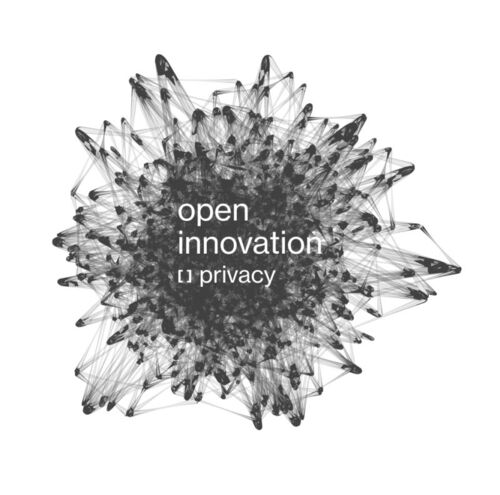

My name is Ana, I am 24 years old, and if you ask anyone, they will tell you that I grew up in the technological age. It has always been a passion of mine, and I have owned a computer since I was eight years old. As a result, I have studied Computer Engineering and I am currently working in the technology industry. Therefore, I have studied my digital rights and have learned how to respect them. I feel confident on the internet… Or at least, I felt confident.

We have all heard about cookies. They are pieces of data that are stored on a website. They could store ‘harmless’ data, such as your username when you log into your account, or delicate data, such as your full name. All websites use them, like e-commerce sites, and thanks to current privacy concerns, we have laws like GDPR that require websites to warn us about their use of cookies and give us the option of accepting, rejecting, or accepting only part of them.

So, you feel that you have control over your data. Why shouldn’t you trust the e-commerce site you visit? They are following the law and providing you the option to choose. However, this option is meaningless if the information provided by the website is incorrect. If they are not going to respect your decision. If they are going to disguise invasive cookies into harmless ones. Whether on intention or not.

I recently discovered that the data consent banners we see on the websites are inaccurate.

I have also lately discovered that some of the cookies we allow produce other cookies that are intrusive and do not need to be accepted in order to steal our data.

And I also recently discovered that some companies are attempting to hide cookies into other ones.

Is your data worth the misinformation? Is your data more valuable than you? No, I don't believe so. We must enforce data respect and develop tools to determine whether or not we are being respected. You have the right to know what your personal information is being used for.

That is why, at [Empathy.co](empathy.co), we ventured on an ambitious program: Open Innovation in Privacy. On this program, we are developing those tools, and will soon begin showing them to the world. If you'd like to learn more about these new technologies, please visit our website at [oi.empathy.co](https://oi.empathy.co/#open-privacy) (it's cookie-free!) and keep you informed by following us on LinkedIn.

If I, as a technical person, can’t figure out if I’m being respected… How could a non-technical user do it?

<h3>Source</h3>

[Beyond the front page](https://lnkd.in/dsmjkm4z)

-----

> Original post on LinkedIn [here](https://www.linkedin.com/feed/update/urn:li:activity:7093155987322286080?utm_source=share&utm_medium=member_desktop)

> Image by Empathy.co branding
