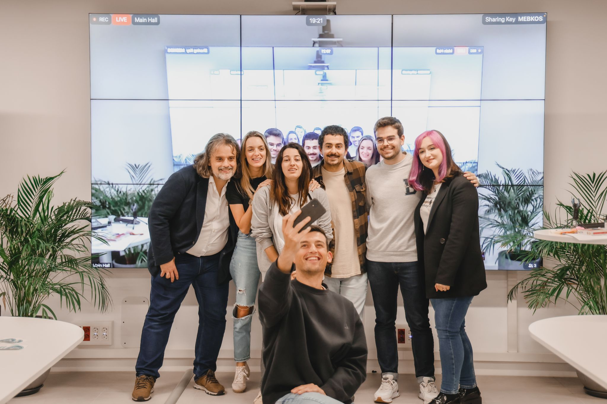
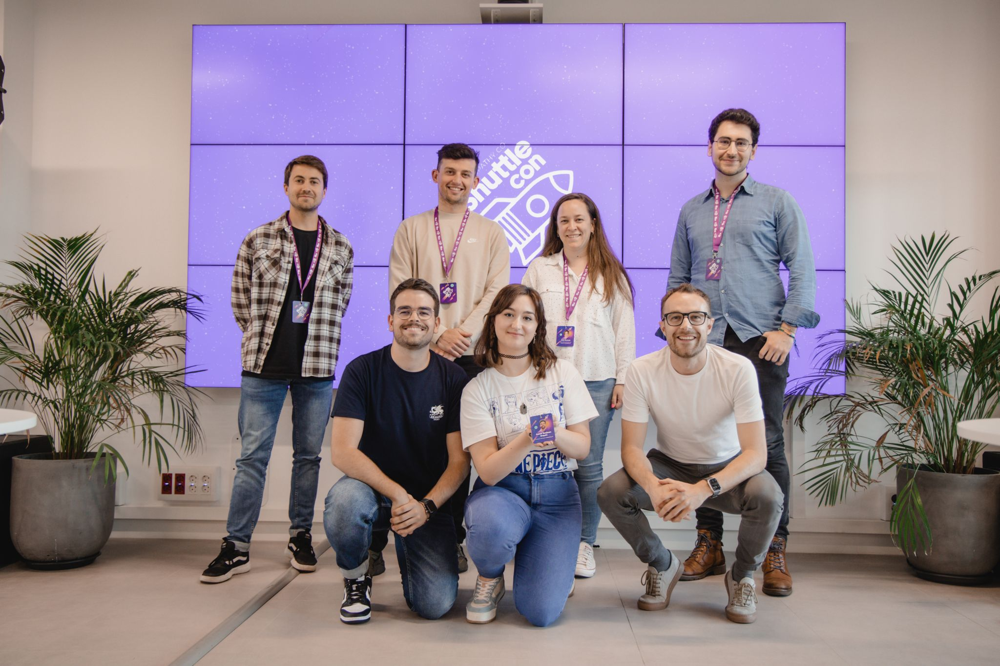
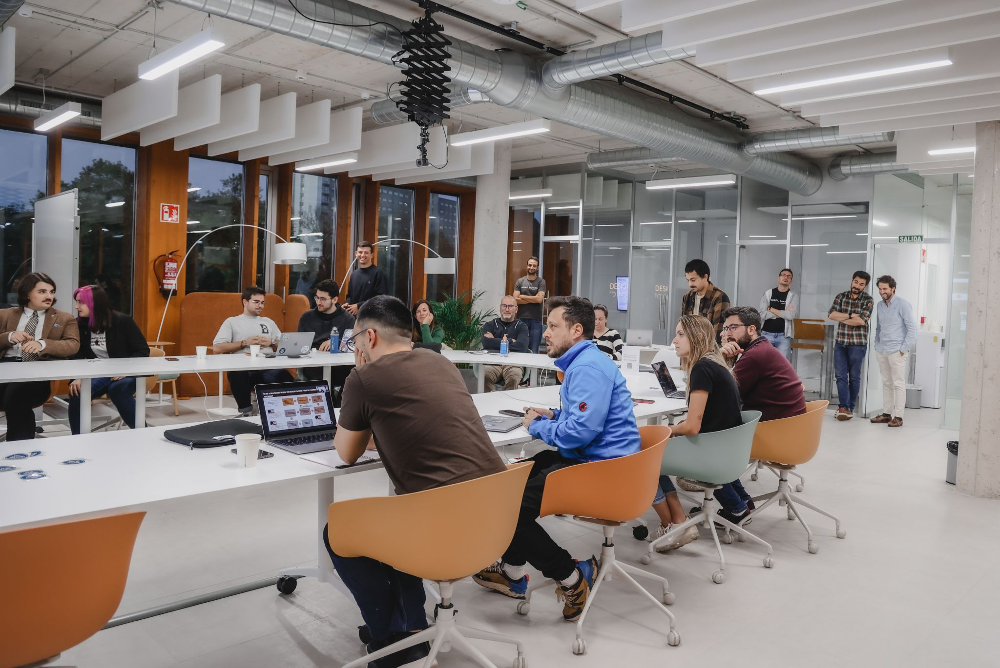

Hey, tech enthusiasts and event aficionados!

My job isn't just about coding and designing software. I can also do one of the things I like most: Organising events.

Last year, I was one of the speakers at the opening of [Empathy.co](https://www.linkedin.com/company/2472920/admin/feed/posts/) ShuttleCon, an event with talks that repeats every few months, each with a fresh theme. It was a fantastic experience!

I liked it so much that I couldn't help but become part of the organisation team for the second edition in April with [Pablo Cañal Suárez](https://www.linkedin.com/in/pablocanalsuarez/). And now... we are bringing you the third edition!

The ShuttleCon is back! This time, we're diving deep into the roots with the theme "Mastering the Basics", because you must first have an excellent base to become the best.

We will have six excellent speakers introducing us to various technologies and themes: [Noelia Vigil Suarez](https://www.linkedin.com/in/nvigil/), [Ricardo Soto Estévez](https://www.linkedin.com/in/sotoestevez/), [Andrea López Suárez](https://www.linkedin.com/in/andrea-l%C3%B3pez-su%C3%A1rez-5115801ba/), [Ramiro Alvarez Fernandez](https://www.linkedin.com/in/ramiro-alvarez-fernandez-3b945b77/), [Daniel Rodriguez Ferrero](https://www.linkedin.com/in/danirofer/) and [Andrea Delgado Alonso](https://www.linkedin.com/in/andrea-delgado-alonso-7039b4177/).

The event will be onsite on Empathy.co Headquarters in Gijón, but also streamed on [Twitch](https://www.twitch.tv/empathyco)!

Save the date – November 30th, 17:30 CET. Head to our [event page](https://socialclub.empathy.co/event/shuttlecon-3rd-edition) for more information, the form to attend onsite and the reveal of talks' titles. 😉

Get ready for an evening of tech talk, inspiration, and a surprise or two. See you at ShuttleCon 3.0 🚀🌐

-----

> Original post on LinkedIn [here](https://www.linkedin.com/posts/anagciaschz_shuttlecon-techtalks-activity-7129798203264094209-GEY0?utm_source=share&utm_medium=member_desktop)

> ShuttleCon branding by [Pablo González Armengol](https://www.linkedin.com/in/pablo-armengol/)
